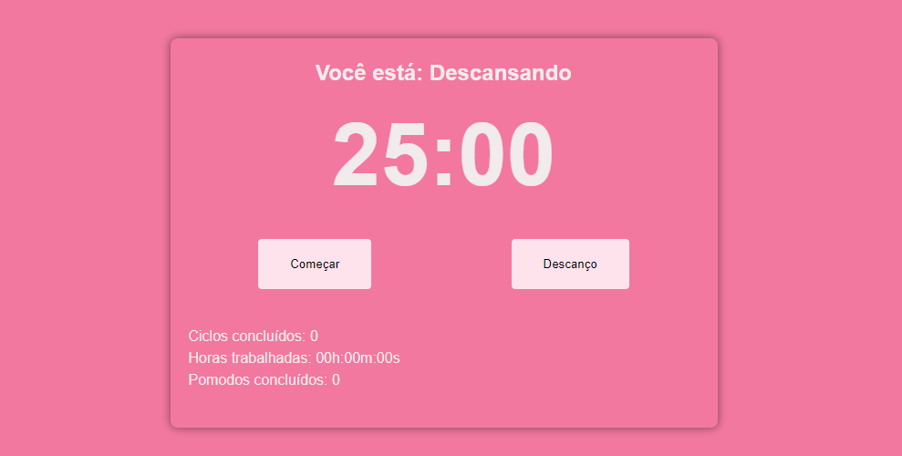

# Pomodoro


Repositório criado para armazenar o código do projeto Pomodoro.

## 💬 Sobre o Projeto

#### Esse projeto foi inspirado na técnica de Pomodoro onde propôs um método de tempo que consiste na utilização de cronómetro para dividir o trabalho em períodos de 25 minutos, separados por breves intervalos, caso esteja interessado em saber mais sobre a técnica acesse aqui ➡ [Técnica pomodoro](https://pt.wikipedia.org/wiki/T%C3%A9cnica_pomodoro)

## 👀 Visualizar

#### Detalhes da página acesse abaixo ⬇⬇⬇



## 🛠️ Instalação do Frontend

Clone este repositório usando o comando

```
git clone https://github.com/Lucassocorrosilva7/Projeto-Pomodoro.git
```

Entrar na pasta utilizando o comando:

```
cd Projeto-Pomodoro-main
```

Instale as dependências com o comando:

```
npm i
```

Para rodar no seu localhost utilize no terminal:

```
npm start
```

#### O projeto ficará disponível na porta http://localhost:3000/

## 💡 Tecnologias

- Html5
- Css3
- Typescript
- React

## ✅ Deploy

#### Para realizar o deploy da minha aplicação, utilizei uma plataforma gratuita de hospedagem de sites estáticos chamada Vercel

## 👤 Autor

#### Feito por Lucas Silva. Entre em contato! 👇

<a href="https://lucas-bio.netlify.app/"></a>
<a href="https://www.linkedin.com/in/luquinhasssilva/"></a>
<a href="mailto:someone@lucassocorrosilva@gmail.com"></a>
